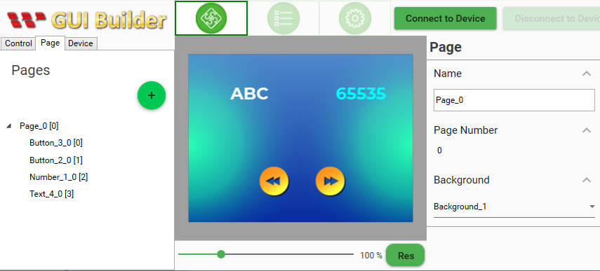

# Modbus-ButtonControlledBrightness
Control brightness using smartdisplay button widgets.

## Materials
* SmartDisplay with RS485/Modbus interface
* Arduino (Uno or Mega2560)
* RS485 shield for Arduino (https://www.dfrobot.com/product-1024.html)
* RS485 dougle

## Libraries
* ModbusMaster (Install using Library Manager)

## UI Design
Reference GUI design for 3.5":

Widget ID |   Type  | Style |Pos X| Pos Y
:--------:|:-------:|:-----:|:----:|:---:
    0     | Button  |   3   |  180 | 160
    1     | Button  |   2   |  100 | 160
    2     | Number  |   1   |  100 | 160
    3     | Text    |   4   |  100 | 160

Please note that only Widget ID and Type matters. You are free to change other attributes.

